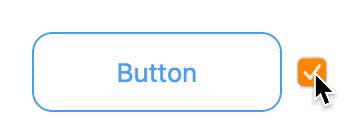

## FlatButton

An easy-to-use `NSButton` subclass to support flat appearance.

## NonDimmingButtonCell

Custom `NSButtonCell` implementation to customize text appearance in disabled state. By default `NSButton` dims its text when disabled, you can use `NonDimmingButtonCell` to prevent this.

## CustomPaddingButtonCell

Custom `NSButtonCell` implementation to customize the content padding within the button.

See [ButtonsDemo](Example/ButtonsDemo) for a complete demo.